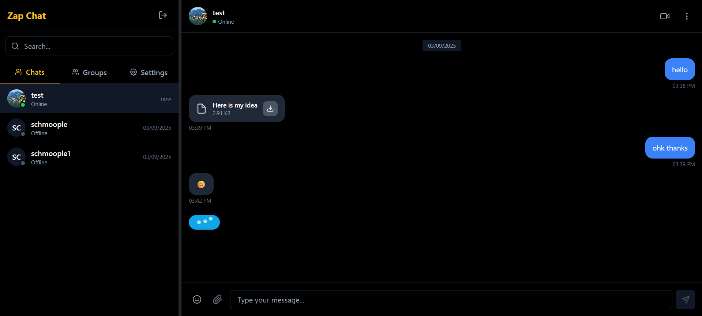

# 🚀 Zap - Real-time Chat Application

A modern, feature-rich real-time chat application built with React, Node.js, Socket.io, and MongoDB. Zap offers seamless communication with advanced real-time features and professional-grade architecture.

## ✨ Core Features

### 💬 Real-time Messaging
- **Instant messaging** with Socket.io
- **Message status indicators** (sent, delivered, read)
- **Typing indicators** - see when others are typing
- **Message history** with intelligent date grouping
- **Delete messages** functionality
- **Clear chat** conversations

### 👥 Group Chat System
- **Create and manage group chats**
- **Multi-user real-time messaging**
- **Group member management**
- **Group-specific file sharing**
- **Group message read receipts**
- **Real-time group notifications**

### 📞 Video Calling System
- **WebRTC-powered video calls**
- **Call notifications** with accept/reject options
- **Real-time peer-to-peer connection**
- **Cross-browser compatibility**

### 📎 Advanced File Sharing
- **Multi-format file support** (PDF, DOC, DOCX, CSV, XML, TXT, JPG, PNG)
- **File size validation** with 10MB smart limits
- **Secure cloud storage** via Cloudinary integration
- **Real-time file transfer** with progress tracking
- **Group file sharing** capabilities

### 👥 User Management & Authentication
- **Google OAuth 2.0** secure authentication
- **Real-time user presence** (online/offline status)
- **Last seen** timestamps with smart formatting
- **Avatar management** with fallback systems
- **Session management** with JWT tokens

### 🎨 Modern Architecture & UI
- **Responsive design** optimized for all devices
- **Dark theme** professional interface
- **Real-time notifications** system
- **Scalable backend** architecture
- **Production-ready** deployment

## 🛠️ Tech Stack

### Frontend
- **React 18** with Vite build system
- **Tailwind CSS** for modern styling
- **Socket.io Client** for real-time communication
- **WebRTC** for video calling infrastructure

### Backend
- **Node.js** with Express.js framework
- **Socket.io** for real-time bidirectional communication
- **MongoDB** with Mongoose ODM
- **JWT** for secure authentication
- **Google OAuth 2.0** via Passport.js
- **Cloudinary** for scalable file storage
- **Multer** for file upload handling

### Production Deployment
- **Frontend**: Vercel (CDN + Edge deployment)
- **Backend**: Render (Auto-scaling containers)
- **Database**: MongoDB Atlas (Cloud clusters)
- **File Storage**: Cloudinary (Global CDN)

## 🌐 Live Demo

**Try Zap Chat now:** [https://zap-nu.vercel.app/](https://zap-nu.vercel.app/)

*Experience real-time messaging, group chats, video calls, and file sharing in action.*

## 📸 Screenshots

### Chat Interface

